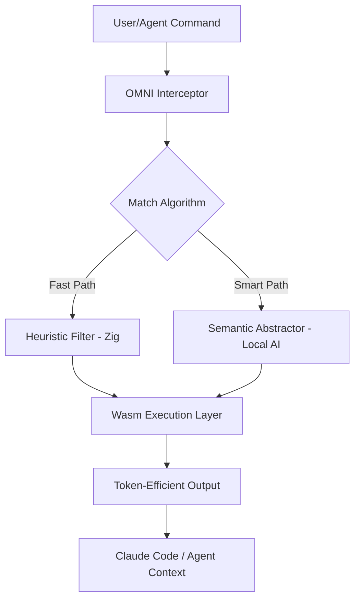

# OMNI Architecture Blueprint

## System Overview

OMNI is designed to be a universal, lightweight, and intelligent token optimization layer. Unlike its predecessors, OMNI utilizes an **Adaptive Filtering** architecture.

## Key Components

### 1. Unified CLI (The Control Center)
- Native binary providing `omni distill`, `omni report`, `omni bench`, `omni setup`, `omni update`, and `omni uninstall`.
- Self-update checking via GitHub Releases API.
- Intelligent environment detection (Homebrew vs installer) for stable symlinks.
- Eliminates the need for external shell-scripts for orchestration.

### 2. OMNI Engine (The Brain)
- **Zig Core:** High-speed filters (Git, Docker, etc.) implemented natively.
- **Wasm Runtime:** Portable execution layer for edge deployments.
- **Persistence:** High-speed LRU caching in the host (TypeScript/MCP) layer.

### 3. MCP Gateway (The Bridge)
- Primary protocol for communication with Claude AI.
- Allows Claude to request specific compression modes in real-time.

## Tech Stack
- **Engine:** Zig (Targeting `wasm32-wasi`).
- **Interface:** TypeScript + Node.js (MCP SDK).
- **Automation:** Zig (for an ultra-lightweight and powerful build system).

## Development Philosophy
- **Performance First:** Startup overhead must be < 1ms (Edge Optimized).
- **Zero-Config:** Operates automatically upon installation.
- **Privacy:** All processing (including semantic summaries) must run locally.
