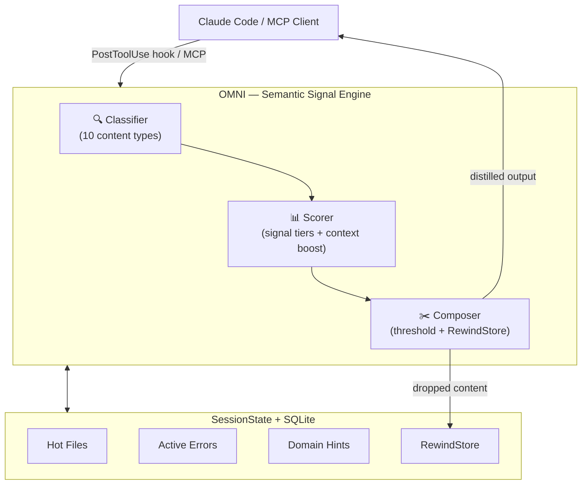

<div align="center">
  

  **Less noise. More signal. Right signal. Reduce AI token consumption by up to 90%.**

  [](https://github.com/fajarhide/omni/actions/workflows/ci.yml)
  [](https://github.com/fajarhide/omni/releases)
  [](https://www.rust-lang.org/)
  [](https://github.com/fajarhide/omni/blob/main/LICENSE)
</div>

<br/>

> **The Semantic Signal Engine that cuts AI token consumption by up to 90%.**<br/>
> OMNI acts as a context-aware terminal interceptor—distilling noisy command outputs in real-time into high-density intelligence, ensuring your LLM agents work with **meaning**, not text waste.

---

## Why OMNI?

When Claude runs `git diff`, `cargo test`, or `kubectl get pods`, it receives **everything** — every "Compiling..." line, every cached Docker layer, every passing test. This noise consumes tokens, dilutes reasoning, and slows your agent down.

Most filters work by **rules**: strip lines matching patterns. OMNI works by **meaning**:

- It **understands** that `error[E0432]` matters more than `Compiling foo v0.1.0`
- It **knows your session** — boosting files you're actively editing
- It **never drops** — compressed content is always retrievable via `omni_retrieve()`

### The Impact
> **Reduce up to 90% AI Token Usage**  
> *Zero Information Loss. Maximum Agent Context. <2ms Overhead.*
<br/>


## How It Works

1. **Classify** — OMNI identifies the content type (git diff, build output, test results, logs) by analyzing structure, not filenames
2. **Score** — Each line gets a semantic relevance score based on signal tier (critical → noise) and your current session context
3. **Compose** — High-signal content is kept, noise is removed, and anything dropped is stored in RewindStore for retrieval

All of this happens **transparently** — your AI agent doesn't know OMNI exists. It just gets better signal.

## Quick Start

```bash
# Install
brew tap fajarhide/omni
brew install omni

# Setup Claude Code hooks (one-time)
omni init --hook

# Verify
omni doctor

# View token savings after your first session
omni stats
```

Or install via script:

```bash
curl -fsSL https://raw.githubusercontent.com/fajarhide/omni/main/scripts/install.sh | sh
omni init --hook
```

## What Gets Distilled?

| Content Type | Example Command | Typical Reduction | What's Kept |
|---|---|---|---|
| **Git Diff** | `git diff HEAD~3` | 56-80% | File tree, changed hunks, +/- lines |
| **Git Status** | `git status` | 70-80% | Branch, staged/modified/untracked summary |
| **Build Output** | `cargo build` | 65-85% | Error count, error messages, warnings |
| **Test Results** | `pytest`, `cargo test` | 70-90% | Pass/fail count, failure details |
| **Infrastructure** | `kubectl get pods` | 60-75% | Pod status summary, non-running details |
| **Docker** | `docker build .` | 70-85% | Step count, cache hits, image ID |
| **Logs** | access logs, app logs | 0-40% | Errors, warnings, anomalies |

### Before & After

**`docker build .`** — 15 lines → 1 line (81% reduction)
```
# Before (what Claude sees without OMNI):
Step 1/15 : FROM node:18-alpine
 ---> a1b2c3d4e5f6
Step 2/15 : RUN npm install
 ---> Using cache
Step 3/15 : COPY . .
 ---> Running in 9876543210
...11 more steps...
Successfully built 9b9c9d09a123

# After (what Claude sees with OMNI):
docker: 5 steps | 1 cached | Successfully built 9b9c9d09a123
```

## Session Continuity

OMNI doesn't just compress — it **understands your session context**.

When you're debugging `src/auth/mod.rs`, OMNI:
- **Boosts** any output mentioning `auth/mod.rs` (because it's a hot file)
- **Prioritizes** errors matching patterns you've seen before
- **Infers** your task domain ("auth module") for smarter scoring
- **Persists** across compaction events, so Claude never loses context

This is powered by the `SessionState` engine that tracks hot files, recent commands, active errors, and domain hints — all stored in local SQLite.

## RewindStore — Never Drop, Always Retrievable

When OMNI compresses aggressively, the original content isn't deleted — it's stored in the **RewindStore** with a SHA-256 hash:

```
[omni: 1,247 chars stored → omni_retrieve("a1b2c3d4")]
```

If Claude needs the full content, it simply calls `omni_retrieve("a1b2c3d4")` via MCP and gets everything back. **Zero information loss, guaranteed.**

## Custom TOML Filters

Extend OMNI for your company's internal tools without writing code:

```toml
# ~/.omni/filters/deploy.toml
schema_version = 1

[filters.deploy]
description = "Company deploy tool"
match_command = "^deploy\\b"
strip_ansi = true

[[filters.deploy.match_output]]
pattern = "Deployment successful"
message = "deploy: ✓ success"

strip_lines_matching = ["^\\[DEBUG\\]", "^Waiting"]
max_lines = 30

[[tests.deploy]]
name = "strips debug lines"
input = """
[DEBUG] Connecting...
Deployment successful
"""
expected = "deploy: ✓ success"
```

Test your filters: `omni learn --verify`

See [docs/FILTERS.md](docs/FILTERS.md) for the complete filter writing guide.

## Analytics Dashboard

```bash
$ omni stats

 ───────────────────────────────────────────────── 
  OMNI Signal Report — last 30 days
 ───────────────────────────────────────────────── 
  Commands processed:  1,247
  Data Distilled:      18.4 MB → 3.2 MB
  Signal Ratio:        82.6% reduction
  Estimated Savings:   $0.046 USD
  Average Latency:     2.1ms
  RewindStore:         23 archived / 8 retrieved

   By Filter:
   1. git          203x  89%  ████████████████████
   2. build         89x  82%  ████████████████
   3. test          44x  79%  ███████████████
   4. infra         31x  76%  █████████████

  Route Distribution:
  Distill:        1247  (97%)
  Keep:             25  ( 2%)
  Drop:             12  ( 1%)
  Passthrough:       0  ( 0%)

  Session Insights:
  Hot files:  src/auth/mod.rs (12), tests/auth_test.rs (8)

 ───────────────────────────────────────────────── 
```

## Supported Agents

| Agent | Integration | Status |
|---|---|---|
| **Claude Code** | PostToolUse hook (automatic) | ✅ Full support |
| **Any MCP client** | MCP server (`omni --mcp`) | ✅ Full support |
| **Shell pipe** | `command \| omni` | ✅ Works now |

## Commands

| Command | Description |
|---|---|
| `omni init --hook` | Setup Claude Code hooks |
| `omni stats` | Token savings analytics |
| `omni session` | Session state inspection |
| `omni learn` | Auto-generate filters from passthrough |
| `omni doctor` | Diagnose installation |
| `omni version` | Print version |
| `omni help` | Show help |
| `cmd \| omni` | Pipe mode — distil any command output |
| `omni --mcp` | Start MCP server |
| `omni --hook` | Hook mode (used by Claude Code) |

See [docs/CLI_REFERENCE.md](docs/CLI_REFERENCE.md) for full usage details.

## Architecture



## Development

To ensure your code meets all quality standards before pushing to the repository, run the comprehensive CI pipeline locally:

```bash
make ci              # Run fmt, clippy, tests, security audit, and binary size checks
```

For individual checks during development:
```bash
cargo build          # Build the binary
cargo test           # Run all 147 tests
cargo insta review   # Review and accept snapshot changes
```

See [CLAUDE.md](CLAUDE.md) and [DEVELOPER.md](docs/DEVELOPER.md) for the full contributor guide.

## Star History

[](https://www.star-history.com/?repos=fajarhide%2Fomni&type=date&legend=top-left)

## License

MIT
