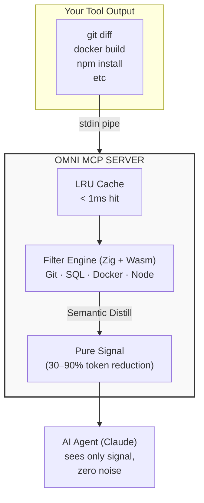

<p align="center">
  
</p>


<h1 align="center">The Semantic Core for the Agentic AI</h1>

<p align="center">
  <a href="https://github.com/fajarhide/omni/actions"></a>
  <a href="https://github.com/fajarhide/omni/releases"></a>
  <a href="https://opensource.org/licenses/MIT"></a>
</p>

<p align="center">
  <strong>The world's first Semantic Density engine for Agentic AI</strong><br>
  Eliminating <strong>80–99% of token noise</strong> with <strong>Zero Semantic Loss</strong>.<br>
  Transforming chaotic tool output into pure, high-density signal · Powered by Zig + Wasm.
</p>

---

## Why OMNI

AI agents running on **Model Context Protocol (MCP)** are limited by the quality of the signal they receive. When Claude runs `git diff`, `docker build`, or `npm install`, it is often flooded with "noise"—redundant lines that dilute its reasoning capacity and bloat your context window.

**OMNI is the Semantic Core.** It sits between your agent and its tools, refining chaotic streams into high-density intelligence. Our goal isn't just to send *fewer* tokens, but to ensure every token sent is *high-signal*.

- **Zero Semantic Loss** — We don't just truncate; we distill. Your AI gets the full context, without the fluff.
- **80% - 99% Token Efficiency** — Achieve massive context savings while improving reasoning signal.
- **Semantic Confidence Scoring** — Every token is analyzed and routed: Keep, Compress (Summarize), or Drop.
- **Cleaner Signal, Better Reasoning** — Benchmarks prove LLMs perform better with 50 pure tokens than 500 noisy ones.
- **< 1ms Engine Latency** — Zero-overhead distillation powered by Zig 0.15.2.
- **Trust Boundary** — Military-grade security filters with SHA-256 verification.


---

## CLI Subcommands: Unified Intelligence

OMNI provides a powerful, multi-purpose CLI that consolidates all diagnostic and reporting tools:

| Subcommand | Purpose |
| :--- | :--- |
| **`distill`** | The core semantic engine (default behavior via stdin). |
| **`density`** | Analyzes context gain and "Information per Token" metrics. |
| **`report`** | Generates a unified system status and performance summary. |
| **`bench`** | High-speed benchmark for semantic throughput. |
| **`generate`** | Outputs templates for Claude Code, Antigravity, and others. |
| **`setup`** | Interactive guide for integration and standard aliasing. |
| **`update`** | Check for the latest version from GitHub Releases. |
| **`uninstall`** | Remove OMNI and clean up all MCP configurations. |

---

## How OMNI Works

OMNI sits between your AI agent and the outside world — silently distilling chaotic output into pure, high-density signal.


---
**No filter match** → passthrough unchanged (zero overhead)


## The OMNI Effect

**Before OMNI** (LLM sees 600+ tokens of noise):
```
$ docker build .
Step 1/15 : FROM node:18
 ---> 4567f123
Step 2/15 : RUN npm install
... (500 lines of noise) ...
Successfully built 1234abcd
```

**After OMNI Distillation** (LLM sees 15 tokens of signal):
```
Step 1/15 : FROM node:18
Step 2/15 : RUN npm install (CACHED)
Step 3/15 : COPY . .
Successfully built!
```

That's **98% fewer tokens**. The LLM gets the same signal — all builds pass — without the noise.

---

## Integration: Using OMNI Everywhere

OMNI is a standard **Model Context Protocol (MCP)** server.

### Claude Code & Claude CLI
The OMNI CLI is for humans, but **`omni-mcp`** is for your AI. It allows Claude or Antigravity to use OMNI's distillation tools automatically.

To register OMNI as an MCP server for Claude Code automatically, run:
```bash
omni generate claude-code
```
This command will automatically detect your absolute home path and register OMNI with Claude Code.

Verify with:
```bash
claude mcp list
```

### Antigravity (Google)
Simply run the automatic generator from the terminal:
```bash
omni generate antigravity
```
*This command will automatically locate your `~/.gemini/antigravity/mcp_config.json`, safely merge OMNI's configurations into your existing servers without overwriting them, and save the file.*

### Auto-Generate Config
Use the CLI to generate ready-to-paste configurations:
```bash
omni generate claude-code    # For Claude Code / Claude CLI
omni generate antigravity     # For Google Antigravity
omni setup                    # Full interactive guide
```

---

## "Always-On" Integration: Agent Autopilot

To ensure your AI agent **always** uses OMNI for maximum token efficiency, add these **Custom Instructions** to your agent's settings (e.g., in `.claudebashrc` or Antigravity custom instructions):

> **OMNI Directive**: You are equipped with the OMNI Semantic Distillation layer. Always prioritize `omni_execute`, `omni_read_file`, and `omni_list_dir` for environment interactions. OMNI is the source of truth for high-density signal. Use it to preserve your context window and speed up your reasoning.

By providing these instructions, the agent will favor OMNI's tools, saving you up to 90% in token costs automatically.

## The Adaptive Intelligence: Proxy & Distillation

OMNI serves as the **Intelligent Nerve Center** for your development environment, acting as a high-performance wrapper that ensures only high-value information reaches your AI.

### 1. Zero-Latency Command Proxy (`--`)
Transform any native command into an AI-ready signal instantly. OMNI intercepts the stream and refines it in real-time without adding overhead.
```bash
omni -- git status
# Result: Aggregated repository health (30x more dense)

omni -- docker build .
# Result: Cleaned build layers, surfacing only critical transition states.
```

### 2. Deep Semantic Distillation (`distill`)
Leverage the OMNI Engine's specialized algorithms to convert chaotic logs into structured intelligence.
- **Precision Rewrite**: OMNI doesn't truncate data; it semantically analyzes the stream to retain "intent-critical" details.
- **Context Optimization**: By compressing 10,000 lines into a 20-line distillation, OMNI effectively expands your AI's reasoning capacity.

### 3. Ultra-Fast Benchmarking (`bench`)
Prove the efficiency of the OMNI engine:
```bash
omni bench 1000
```
*Shows: OMNI processes thousands of requests per second with sub-millisecond latency (< 0.01ms), meaning it adds zero noticeable overhead when used as a proxy.*

### Available MCP Tools

OMNI exposes high-density tools that replace standard agent context commands:

| Tool | Purpose | Token Saving |
| :--- | :--- | :--- |
| **`omni_list_dir`** | Dense, comma-separated directory listing (no JSON overhead). | High |
| **`omni_view_file`** | Range-based file reading + Zig distillation. | Massive |
| **`omni_grep_search`** | High-density semantic search results. | High |
| **`omni_find_by_name`** | Recursive flat file discovery. | Medium |
| **`omni_add_filter`** | Add declarative rules without coding. | N/A |
| **`omni_apply_template`** | Apply pre-defined bundles (K8s, TF, Node). | N/A |
| **`omni_execute`** | Run ANY command and distill its output. | Massive (30-90%) |
| **`omni_read_file`** | Full file distillation (great for logs/SQL/json). | Massive |
| **`omni_density`** | Measure gain and reduction metrics. | N/A |

---

## Easy Filtering: Zero Coding Required

You can extend OMNI's intelligence without touching a single line of Zig.

The agent will use `omni_add_filter` to update your configuration instantly. It automatically prioritizes your project-local `omni_config.json` if it exists, otherwise it updates your global `~/.omni/omni_config.json`.

### 2. Apply Technology Templates
Apply bundles of pre-defined rules for your stack via MCP tool:
- **`omni_apply_template(template="terraform")`**
- Supported templates: `kubernetes`, `terraform`, `node-verbose`, `docker-layers`.

See the **[DSL_GUIDE.md](docs/DSL_GUIDE.md)** for full documentation and examples.

---

## ⚙️ Configuration Architecture

OMNI uses a **dual-layer, additive configuration system** to provide both global consistency and project-specific flexibility.

| Layer | Path | Purpose |
| :--- | :--- | :--- |
| **Global** | `~/.omni/omni_config.json` | Your primary rules, shared across all projects and agents. |
| **Local** | `./omni_config.json` | Project-specific overrides or additional rules (e.g., custom masking for a specific repo). |

### How Merging Works
1. OMNI first loads the **Global** configuration.
2. It then loads the **Local** configuration (if present in your current directory).
3. The rules are **combined**. This means rules from both your global setup and your specific project will be applied simultaneously.

### Manual Configuration
You can manually edit these files to define `rules` (exact matching) or `dsl_filters` (complex semantic logic):
```json
{
  "rules": [
    { "name": "mask_token", "match": "api_key:", "action": "mask" }
  ],
  "dsl_filters": [
    { "name": "my-custom-sig", "pattern": "MY_SIGNAL:", "confidence": 1.0 }
  ]
}
```

> [!TIP]
> Use **`omni generate config`** to output a complete, well-commented starter template for your configuration.

### Lifecycle: Creation & Editing
| Event | Action |
| :--- | :--- |
| **Installation** | The `install.sh` script sets up your global `~/.omni/omni_config.json`. |
| **AI Tooling** | Using MCP tools like `omni_add_filter` or `omni_apply_template` will automatically create the file if it doesn't exist. |
| **Manual Edit** | You can edit both global and local files manually at any time using any text editor. |
| **AI Proxy** | AI agents can dynamically add project-specific rules via the OMNI MCP interface without you leaving the chat. |

---

## Performance Monitoring & Metrics

OMNI is obsessed with efficiency. Use these tools to see how much you're saving:

### 1. Unified Efficiency Report
Run this to see a daily/weekly breakdown of tokens saved and latency overhead:
```bash
omni report
```
*Shows: Total commands processed, bytes saved, and average filtering latency (< 1ms).*

### 2. Context Density Analysis
Measure the "Information per Token" gain for any text file or output:
```bash
omni density < build_logs.txt
```
*Output: Calculates the exact Context Density Gain (e.g., 4.5x improvement).*

---

## The OMNI Core Pillars: Pure Intelligence

| Pillar | Description | Value |
| :--- | :--- | :--- |
| **Purity** | **Zero Semantic Loss** via multi-variable confidence scoring. | **Clean Signal** |
| **Density** | Focus on "Information per Token" rather than simple truncation. | **High Context** |
| **Speed** | Zig-powered native engine with sub-millisecond response. | **< 1ms Latency** |
| **Trust** | SHA-256 verified project-local rules and security boundaries. | **Secure** |
| **Portability** | 68KB universal Wasm binary runs on any runtime (Node, Web, Edge). | **Universal** |

### Market-Leading Performance

While other tools focus on simple filtering, OMNI provides a full semantic layer:

| Feature | **OMNI** | Others |
| :--- | :--- | :--- |
| **Processing Engine** | **Zig (Native)** | Python / Go / Rust |
| **Context Strategy** | **Semantic Distillation** | Regex / Passthrough |
| **Wait Overhead** | **Zero (<1ms)** | Visible (10ms - 100ms) |
| **Governance** | **SHA-256 Trust Boundary** | None / Manual |
| **Deployment** | **68KB Wasm / Universal** | Large Native Binaries |

### The OMNI Advantage:
1.  **Context IQ**: OMNI doesn't just shorten text; it *re-writes* it semantically for the LLM based on agentic intent.
2.  **Performance Supremacy**: By using a persistent Wasm instance, OMNI provides instant responses without blocking the main agent execution.
3.  **Local-First Privacy**: Every byte of your code and tool output stays on your machine.

---

## Visualizing Efficiency

1.  **The "Distillation" Effect**: In your AI's tool output, raw logs are transformed into a 10-line summary.
2.  **Faster Response Times**: LLM processes 150x fewer tokens, giving you significantly faster replies.
3.  **Real-time Reports**: Run `omni report` at any time to see the global efficiency health.
4.  **Density Metrics**: Use `omni density < logs.txt` to calculate your exact Context Density Gain.

---

## Installation

### Homebrew (Recommended)
```bash
brew install fajarhide/tap/omni
```

### One-Line Installer (Optimized)
```bash
curl -fsSL https://omni-nine-rho.vercel.app/install | sh
```

For manual build instructions, see **[INSTALL.md](INSTALL.md)**.

### Update & Uninstall
```bash
omni update       # Check for the latest version
omni uninstall    # Remove OMNI and clean up all configs
```

---

## License
MIT © Fajar Hidayat
