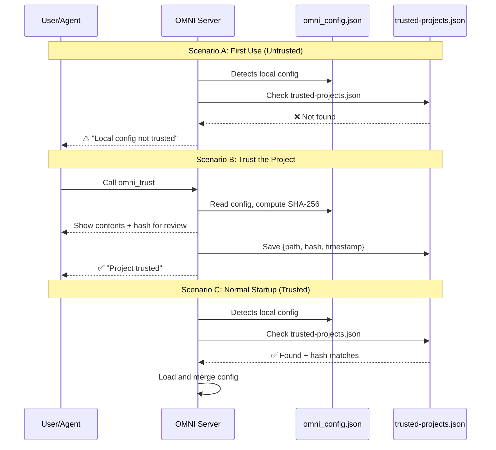

# Security Policy

## Supported Versions

Security updates are applied to the latest release on the `main` branch.

| Version | Supported          |
| ------- | ------------------ |
| v0.4.x  | :white_check_mark: |
| v0.3.x  | :x:                |
| v0.2.x  | :x:                |
| v0.1.x  | :x:                |

## Reporting a Vulnerability

We take the security of OMNI seriously. If you discover a vulnerability, please do not report it publicly. Instead, follow these steps:

1. **Email us**: Send a detailed report to [security@weekndlabs.com](mailto:security@weekndlabs.com).
2. **Details**: Include a description of the issue, steps to reproduce, and potential impact.
3. **Response**: We will acknowledge your report within 48 hours and provide a timeline for a fix.

## Security Considerations

- **Local-only processing**: OMNI processes all data locally. No data is sent to external servers during distillation.
- **Local Metrics data**: Usage stats stored in `~/.omni/metrics.csv` contain only aggregate metrics (timestamps, byte counts, latency), never the actual content. **No data ever leaves your machine.**
- **MCP Server**: The MCP server runs locally via `stdio` transport and does not expose any network ports.
- **`omni update`**: Only reads the public GitHub Releases API (no authentication required). No data is uploaded.

---

## 1. Project Trust Boundary

OMNI will **not** load project-local `omni_config.json` files until you explicitly trust them. This prevents a malicious repository from injecting custom filter rules that could hide important output from your AI agent.

### How it Works

```
 Your Project/
 ├── omni_config.json   ← OMNI sees this but WON'T load it
 └── ...

 ~/.omni/
 └── trusted-projects.json  ← Trust registry (path + SHA-256 hash)
```

1. OMNI detects `omni_config.json` in the project directory.
2. It checks `~/.omni/trusted-projects.json` for the project path **and** a matching SHA-256 hash.
3. If not found or hash doesn't match → **config is skipped**, OMNI logs a warning.
4. If trusted and hash matches → config is loaded normally.

### Quick Start

**Trust a project for the first time:**
```
Call the `omni_trust` MCP tool (or ask your AI agent to run it).
```

The tool will:
- Display the full config contents for your review
- Show the SHA-256 fingerprint
- Add the project to `~/.omni/trusted-projects.json`

**After editing your local config:**
```
Run `omni_trust` again to re-verify and update the hash.
```

> [!IMPORTANT]
> If you modify `omni_config.json` after trusting, OMNI will **stop loading it** until you re-trust. This protects against silent config tampering.

### What Happens When Config is Untrusted?

| Scenario | OMNI Behavior |
| :--- | :--- |
| No local config exists | Global config only (normal) |
| Local config exists, **not trusted** | Skipped. Logs: `⚠ Local config not trusted. Run omni_trust to review and trust.` |
| Local config exists, **trusted** | Loaded and merged with global config |
| Local config **modified** after trust | Skipped. Logs: `⚠ Local config modified since last trust. Run omni_trust to re-verify.` |

### Trust Flow Diagram



---

## 2. Sandbox Environment Denylist

OMNI **strips 50+ dangerous environment variables** from all child processes it spawns. This prevents environment-based attacks where malicious env vars could hijack command execution.

### Why This Matters

Some environment variables can inject code into any process that reads them:

| Variable | Risk |
| :--- | :--- |
| `BASH_ENV` | Shell runs this file **before** executing any command |
| `NODE_OPTIONS` | Injects flags/code into every Node.js process |
| `LD_PRELOAD` | Loads a shared library into **every** process (Linux) |
| `DYLD_INSERT_LIBRARIES` | Same as `LD_PRELOAD` (macOS) |
| `PYTHONSTARTUP` | Python executes this file on startup |
| `JAVA_TOOL_OPTIONS` | Injects JVM arguments into every Java process |

### What OMNI Blocks

All child processes spawned by OMNI tools (`omni_execute`, `Bash`, `run_command`, `omni_grep_search`, `omni_find_by_name`) receive a **sanitized** copy of `process.env` with these categories removed:

- **Shell injection**: `BASH_ENV`, `ENV`, `ZDOTDIR`, `BASH_PROFILE`, `PROMPT_COMMAND`, `IFS`, etc.
- **Runtime hijacking**: `NODE_OPTIONS`, `PYTHONSTARTUP`, `RUBYOPT`, `PERL5OPT`, `JAVA_TOOL_OPTIONS`
- **Dynamic linker**: `LD_PRELOAD`, `LD_LIBRARY_PATH`, `DYLD_INSERT_LIBRARIES`, `DYLD_FRAMEWORK_PATH`
- **Path manipulation**: `PYTHONPATH`, `RUBYLIB`, `GEM_PATH`, `NODE_PATH`, `CLASSPATH`
- **Proxy/TLS hijacking**: `HTTP_PROXY`, `HTTPS_PROXY`, `SSL_CERT_FILE`, `CURL_CA_BUNDLE`
- **Git injection**: `GIT_ASKPASS`, `GIT_SSH_COMMAND`, `GIT_CONFIG_GLOBAL`

> [!NOTE]
> This is transparent — you don't need to configure anything. OMNI automatically sanitizes the environment for every command it runs.

---

## Security Tools Summary

| Tool | Purpose | When to Use |
| :--- | :--- | :--- |
| `omni_trust` | Trust a project's local `omni_config.json` | After cloning a repo with config, or after editing config |

---

Thank you for helping keep OMNI secure!
