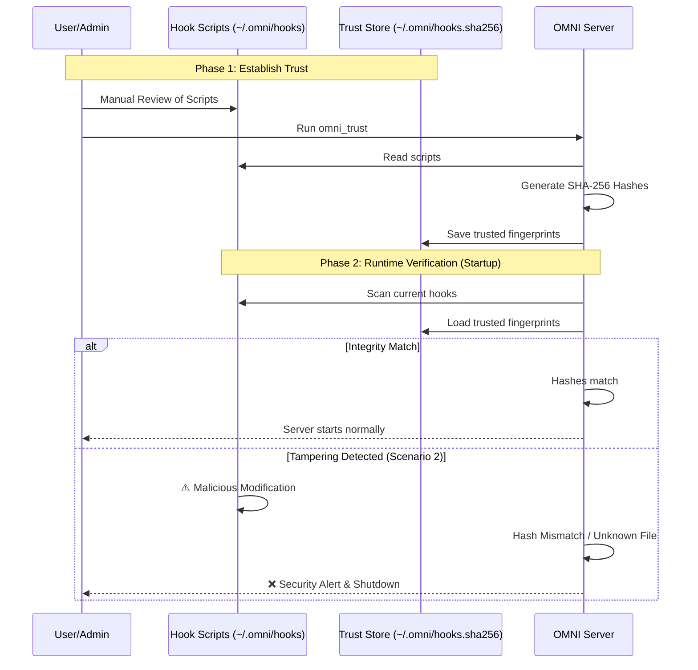

# Security Policy

## Supported Versions

Security updates are applied to the latest release on the `main` branch.

| Version | Supported          |
| ------- | ------------------ |
| v0.4.x  | :white_check_mark: |
| v0.3.x  | :x:                |
| v0.2.x  | :x:                |
| v0.1.x  | :x:                |

## Reporting a Vulnerability

We take the security of OMNI seriously. If you discover a vulnerability, please do not report it publicly. Instead, follow these steps:

1. **Email us**: Send a detailed report to [security@weekndlabs.com](mailto:security@weekndlabs.com).
2. **Details**: Include a description of the issue, steps to reproduce, and potential impact.
3. **Response**: We will acknowledge your report within 48 hours and provide a timeline for a fix.

## Security Considerations

- **Local-only processing**: OMNI processes all data locally. No data is sent to external servers during distillation.
- **Local Metrics data**: Usage stats stored in `~/.omni/metrics.csv` contain only aggregate metrics (timestamps, byte counts, latency), never the actual content. **No data ever leaves your machine.**
- **MCP Server**: The MCP server runs locally via `stdio` transport and does not expose any network ports.
- **`omni update`**: Only reads the public GitHub Releases API (no authentication required). No data is uploaded.
- **Hook Integrity Check**: OMNI provides a security mechanism to verify the integrity of hook scripts located in `~/.omni/hooks/`.

### How it Works:
1. **User Approval**: You manually inspect your scripts and run the `omni_trust` tool.
2. **Digital Fingerprint**: OMNI records a unique "fingerprint" (SHA-256) for each approved script.
3. **Auto-Verification**: Every time OMNI starts, it compares the current scripts' fingerprints with the trusted records.
4. **Lockdown**: If any script is modified without approval or a new suspicious script is detected, OMNI will refuse to start to protect your system.

> [!IMPORTANT]
> **Updating Trusted Scripts**: Any modification to a hook script's content changes its SHA-256 hash. If you update your hooks, you must re-run the `omni_trust` tool to update the `hooks.sha256` file with the new fingerprints.

Thank you for helping keep OMNI secure!
